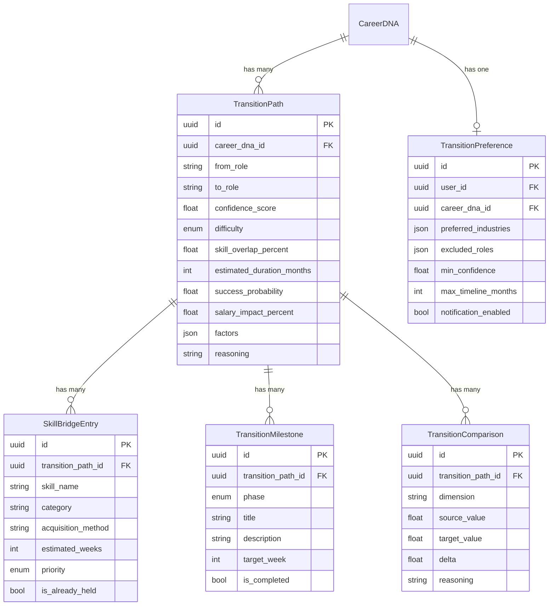
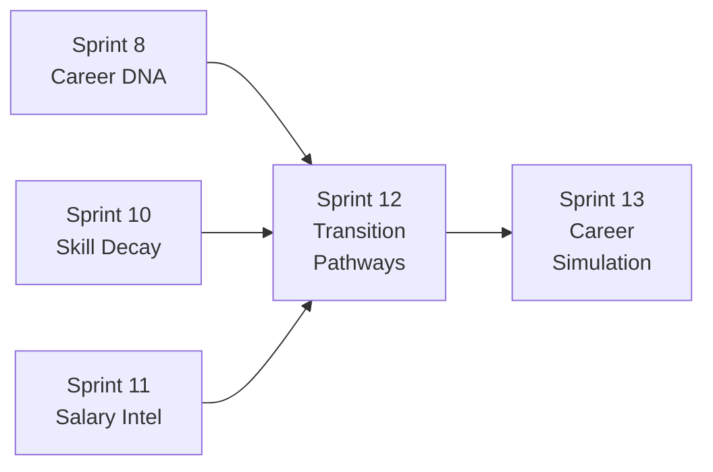

# Sprint 12 — Transition Pathways Architecture

> **Sprint**: 12 | **Phase**: B (Career Intelligence) | **Date**: 2026-02-20
> **Status**: Implementation approved
> **Architecture Reference**: `ARCHITECTURE.md` Section 7, 10.4

---

## 1. Overview

Transition Pathways democratizes enterprise-grade career transition intelligence (Gloat $100K+, Eightfold AI) for individual consumers. The module analyzes career movement feasibility, generates evidence-based pivot paths, and models success probability using Career DNA context combined with LLM intelligence.

**Market gap confirmed**: No consumer-grade platform offers career transition probability modeling. Enterprise platforms restrict this intelligence to internal-only organizational moves.

---

## 2. Competitive Landscape

| Platform  | Approach                                | Limitation                                     |
| :-------- | :-------------------------------------- | :--------------------------------------------- |
| LinkedIn  | "People also moved to" static cards     | No success rate, no skill gap, no timeline     |
| Teal      | "Explore Career Paths" generic roadmaps | No data-driven probability, no personalization |
| Huntr     | Anonymized job search trends            | No career movement patterns                    |
| Gloat     | AI internal mobility ($100K+)           | Enterprise-only, internal moves only           |
| Eightfold | Deep-learning talent intelligence       | Enterprise-only, recruiter-facing              |
| Glassdoor | User-submitted career path reviews      | Anecdotal, unstructured                        |
| BLS/ONET  | Occupation transition matrices          | Raw government data, not actionable            |

---

## 3. Proprietary Innovations

### 3.1 🔥 Transition Confidence Score™

Personalized success probability (0–100) combining:

- Skill overlap percentage (Career DNA → target role)
- Market demand for target role (Skill Decay data)
- Historical transition difficulty (LLM + structured data)
- Seniority gap analysis
- Hard-capped at 0.85 (LLM-only estimate ceiling)

### 3.2 🔥 Skill Bridge Matrix™

Per-skill gap analysis for each transition:

- Required skills vs. current skills
- Priority ordering (critical → nice-to-have)
- Estimated learning time per skill
- Recommended acquisition methods (certifications, courses, projects)

### 3.3 🔥 Career Velocity Corridor™

Realistic timeline ranges:

- Optimistic / realistic / conservative duration estimates
- Factors: experience level, market conditions, skill overlap
- Milestone checkpoints for progress tracking

### 3.4 🔥 Transition Timeline Engine™

Structured, phased action plans:

- 4 phases: preparation → skill_building → transition → establishment
- Week-by-week recommended activities
- Progress tracking anchors

---

## 4. Domain Model

### 4.1 Entity Diagram



### 4.2 Enums

| Enum                   | Values                                                 |
| :--------------------- | :----------------------------------------------------- |
| `TransitionDifficulty` | easy, moderate, challenging, extreme                   |
| `TransitionStatus`     | draft, active, completed, abandoned                    |
| `MilestonePhase`       | preparation, skill_building, transition, establishment |
| `SkillBridgePriority`  | critical, high, medium, nice_to_have                   |

---

## 5. AI Pipeline

### 5.1 Processing Flow

```
Input: (Career DNA + Target Role)
              │
    ┌─────────▼──────────┐
    │  analyze_transition │  LLM Call #1
    │  confidence, skill  │  → Confidence score, difficulty,
    │  overlap, timeline  │     skill overlap %, timeline
    └─────────┬──────────┘
              │
    ┌─────────▼──────────┐
    │ generate_skill_     │  LLM Call #2
    │ bridge              │  → Ordered skill gaps,
    │                     │     time estimates, methods
    └─────────┬──────────┘
              │
    ┌─────────▼──────────┐
    │ create_milestones   │  LLM Call #3
    │                     │  → Phased action plan,
    │                     │     weekly targets
    └─────────┬──────────┘
              │
    ┌─────────▼──────────┐
    │ compare_roles       │  LLM Call #4
    │                     │  → Salary, demand, growth,
    │                     │     automation risk deltas
    └─────────┬──────────┘
              │
    ┌─────────▼──────────┐
    │   Persist to DB     │
    │   Return composite  │
    └─────────────────────┘
```

### 5.2 Static Helpers

| Method                            | Purpose                                                               |
| :-------------------------------- | :-------------------------------------------------------------------- |
| `compute_skill_overlap()`         | Calculate % overlap between current and target skill sets             |
| `compute_transition_difficulty()` | Map overlap + seniority gap → difficulty enum                         |
| `estimate_timeline_range()`       | Compute optimistic / realistic / conservative durations               |
| `compute_transition_confidence()` | Combine overlap, market demand, and LLM score into capped probability |

---

## 6. API Surface

10 REST endpoints at `/api/v1/transition-pathways`:

| Method | Path                 | Description                        | Rate Limit |
| :----- | :------------------- | :--------------------------------- | :--------- |
| GET    | `/dashboard`         | Full dashboard                     | —          |
| POST   | `/explore`           | Explore transition (full pipeline) | 3/min      |
| GET    | `/`                  | List saved transitions             | —          |
| GET    | `/{id}`              | Get specific transition            | —          |
| DELETE | `/{id}`              | Delete transition                  | —          |
| GET    | `/{id}/skill-bridge` | Skill gap analysis                 | —          |
| GET    | `/{id}/milestones`   | Action plan                        | —          |
| GET    | `/{id}/comparison`   | Role comparison                    | —          |
| POST   | `/what-if`           | Quick role exploration             | 3/min      |
| GET    | `/preferences`       | Get preferences                    | —          |
| PUT    | `/preferences`       | Update preferences                 | —          |

---

## 7. Cross-Sprint Integration



- **Inputs from**: Career DNA (skills, role, seniority), Skill Decay (market demand), Salary Intelligence (compensation data)
- **Outputs to**: Career Simulation Engine (Sprint 13) — `TransitionPath` is a direct dependency

---

## 8. Ethics & Safety

| Risk                           | Mitigation                                               |
| :----------------------------- | :------------------------------------------------------- |
| Overpromising success rates    | Confidence hard-capped at 0.85, mandatory disclaimer     |
| Role-gender bias               | Gender-neutral prompts, no demographic scoring           |
| Discouraging valid transitions | Never frame low confidence as "impossible"               |
| Geographic bias                | Location-aware analysis, data coverage flags             |
| GDPR compliance                | All data is AI-generated, not aggregated from real users |

---

> **Document Classification**: Sprint Architecture Reference
> **Maintained by**: Antigravity AI Kit v2.0.0 Cognitive Engine
> **Review Cadence**: Updated at sprint completion
