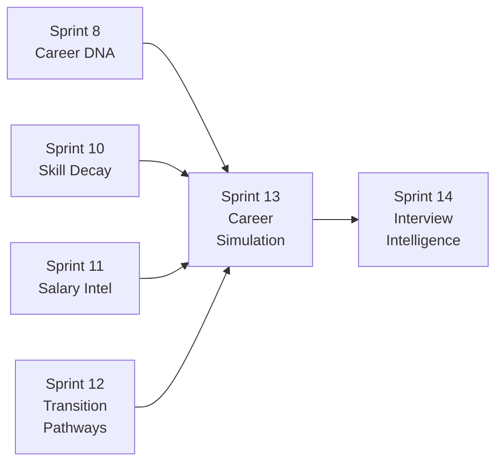

# Sprint 13 — Career Simulation Engine™ Architecture

> **Sprint**: 13 | **Phase**: C (Network Intelligence) | **Date**: 2026-02-21
> **Status**: Implementation approved
> **Architecture Reference**: `ARCHITECTURE.md` Section 7, 10.4

---

## 1. Overview

The Career Simulation Engine™ is the industry's first consumer-grade "what-if" career planning tool — bringing Monte Carlo–style scenario modeling to individual career decisions. Financial planning has had simulator tools for decades; career planning has had nothing.

This module enables users to simulate role transitions, geographic moves, skill investments, industry pivots, and seniority jumps, then receive personalized projections with confidence scores, timelines, salary impacts, and actionable recommendations.

**Market gap confirmed**: No consumer-level what-if career simulation exists. Enterprise solutions (Eightfold $100K+, TalentGuard) serve organizations only. MIT Digital Twins (Dec 2025) validates the concept academically but has no productized offering.

---

## 2. Competitive Landscape

| Platform              | Approach                                 | Limitation                                       |
| :-------------------- | :--------------------------------------- | :----------------------------------------------- |
| Eightfold.ai          | ML-powered talent pathing (enterprise)   | $100K+/year, org-level only, not individual      |
| TalentGuard           | Skills-based career pathing (enterprise) | Enterprise-only, predictive workforce analytics  |
| LinkedIn              | Static Skills Graph                      | No scenario modeling, recruiter-facing only      |
| Indeed / Glassdoor    | Static salary averages                   | No personal projections, no what-if scenarios    |
| Teal / Huntr          | Application tracking only                | No career intelligence layer                     |
| FutureSelf AI         | Emerging trajectory mapping              | Limited, no multi-scenario comparison            |
| Google Career Dreamer | Experimental skills-to-path matching     | No what-if scenarios, research-only              |
| MIT Digital Twins     | AI digital twins for life simulation     | Research paper (Dec 2025), no consumer product   |
| CareerExplorer        | Satisfaction-based matching              | No scenario modeling, no financial projections   |
| Forage                | Virtual job simulations                  | Work experience simulations, not career path sim |

---

## 3. Proprietary Innovations

### 3.1 🔥 Career Scenario Simulator™

Multi-variable what-if engine supporting 5 scenario types:

| Scenario             | Input                                      | Output                                                           |
| :------------------- | :----------------------------------------- | :--------------------------------------------------------------- |
| **Role transition**  | "What if I switch from Backend to ML?"     | Time: 6-9mo, skill gap: 4, salary: +15%, success: 72%            |
| **Geo move**         | "What if I move from Amsterdam to Berlin?" | Salary Δ: -5%, demand Δ: +12%, CoL: -18%, visa: EU free movement |
| **Skill investment** | "What if I learn Kubernetes?"              | Market value: +€6.5K, new matches: +340, time: 3mo               |
| **Industry pivot**   | "What if I move fintech → healthtech?"     | Skill overlap: 65%, salary: ±8%, growth: +22% YoY                |
| **Seniority jump**   | "What if I go for a lead role?"            | Requirements: 3 gaps, timeline: 12-18mo, salary: +€12K           |

### 3.2 🔥 Scenario Confidence Metric™

Composite confidence score combining:

- Skill overlap percentage (Career DNA → target requirements)
- Market demand alignment (Skill Decay data)
- Transition feasibility (LLM-assessed complexity)
- Data quality factor (number of data points available)
- Hard-capped at **0.85** — LLM projections are never presented as certain

### 3.3 🔥 ROI Calculator™

Per-scenario return-on-investment computation:

```
ROI = (Projected Salary Δ × 12 months)
    ÷ (Skills Investment Time × Opportunity Cost Rate)
    × Confidence Adjustment Factor
```

Outputs: payback period (months), annual ROI (%), break-even seniority.

### 3.4 🔥 Scenario Comparison Matrix™

Side-by-side comparison of up to 5 simultaneous scenarios:

- Ranked by composite desirability score
- Dimensions: salary Δ, time investment, skill gap count, confidence, growth outlook
- Trade-off visualization per dimension

---

## 4. Domain Model

### 4.1 Entity Diagram

```mermaid
erDiagram
    CareerDNA ||--o{ CareerSimulation : "has many"
    CareerDNA ||--o| SimulationPreference : "has one"
    CareerSimulation ||--o{ SimulationInput : "has many"
    CareerSimulation ||--o{ SimulationOutcome : "has many"
    CareerSimulation ||--o{ SimulationRecommendation : "has many"

    CareerSimulation {
        uuid id PK
        uuid career_dna_id FK
        enum scenario_type
        float confidence_score
        enum status
        float roi_score
        float feasibility_rating
        float salary_impact_percent
        int estimated_months
        string reasoning
        json factors
        string data_source
        string disclaimer
    }

    SimulationInput {
        uuid id PK
        uuid simulation_id FK
        string parameter_name
        string parameter_value
        string parameter_type
    }

    SimulationOutcome {
        uuid id PK
        uuid simulation_id FK
        string dimension
        float current_value
        float projected_value
        float delta
        string unit
        string reasoning
    }

    SimulationRecommendation {
        uuid id PK
        uuid simulation_id FK
        enum priority
        string title
        string description
        int estimated_weeks
        int order_index
    }

    SimulationPreference {
        uuid id PK
        uuid user_id FK
        uuid career_dna_id FK
        enum default_scenario_type
        int max_scenarios
        bool notification_enabled
    }
```



### 4.2 Enums

| Enum                     | Values                                                                      |
| :----------------------- | :-------------------------------------------------------------------------- |
| `ScenarioType`           | role_transition, geo_move, skill_investment, industry_pivot, seniority_jump |
| `SimulationStatus`       | draft, computed, saved, archived                                            |
| `RecommendationPriority` | critical, high, medium, nice_to_have                                        |

---

## 5. AI Pipeline

### 5.1 Processing Flow

```
Input: (Career DNA + Scenario Parameters)
              │
    ┌─────────▼──────────┐
    │  analyze_scenario   │  LLM Call #1
    │  confidence, feasi- │  → Confidence score, feasibility,
    │  bility, complexity │     salary impact, timeline
    └─────────┬──────────┘
              │
    ┌─────────▼──────────┐
    │  project_outcomes   │  LLM Call #2
    │                     │  → Dimensional projections:
    │                     │     salary, demand, growth, risk
    └─────────┬──────────┘
              │
    ┌─────────▼──────────┐
    │  generate_recom-    │  LLM Call #3
    │  mendations         │  → Prioritized action steps
    │                     │     with time estimates
    └─────────┬──────────┘
              │
    ┌─────────▼──────────┐
    │  Persist to DB      │
    │  Return composite   │
    └─────────────────────┘

Compare Flow (separate):
    ┌─────────────────────┐
    │  compare_scenarios  │  LLM Call #4
    │  Up to 5 scenarios  │  → Ranked comparison matrix,
    │                     │     trade-off analysis,
    │                     │     recommendation
    └─────────────────────┘
```

### 5.2 Static Helpers

| Method                          | Purpose                                                          |
| :------------------------------ | :--------------------------------------------------------------- |
| `compute_scenario_confidence()` | Combine skill overlap, market demand, LLM score → capped at 0.85 |
| `compute_roi_score()`           | Calculate return-on-investment from salary Δ and time investment |
| `compute_feasibility_rating()`  | Map skill gap count + timeline → feasibility percentage (0-100)  |
| `normalize_salary_delta()`      | Normalize salary differences accounting for CoL and currency     |

### 5.3 Clamping Validators

| Validator                      | Purpose                                                   |
| :----------------------------- | :-------------------------------------------------------- |
| `_clamp_simulation_analysis()` | Cap confidence at 0.85, enforce valid enums, clamp ranges |
| `_clamp_outcomes()`            | Ensure delta consistency, enforce valid units             |
| `_clamp_recommendations()`     | Validate priorities, cap estimated_weeks at 104 (2 years) |

---

## 6. API Surface

11 REST endpoints at `/api/v1/career-simulation`:

| Method | Path                  | Description                   | Rate Limit |
| :----- | :-------------------- | :---------------------------- | :--------- |
| GET    | `/dashboard`          | All saved simulations + prefs | —          |
| POST   | `/simulate/role`      | Role transition scenario      | 5/min      |
| POST   | `/simulate/geo`       | Geographic move scenario      | 5/min      |
| POST   | `/simulate/skill`     | Skill investment scenario     | 5/min      |
| POST   | `/simulate/industry`  | Industry pivot scenario       | 5/min      |
| POST   | `/simulate/seniority` | Seniority jump scenario       | 5/min      |
| POST   | `/compare`            | Compare up to 5 simulations   | 3/min      |
| GET    | `/{id}`               | Get specific simulation       | —          |
| DELETE | `/{id}`               | Delete simulation             | —          |
| GET    | `/preferences`        | Get preferences               | —          |
| PUT    | `/preferences`        | Update preferences            | —          |

---

## 7. Cross-Sprint Integration



- **Inputs from**: Career DNA (skills, role, seniority), Skill Decay (market demand curves), Salary Intelligence (compensation data), Transition Pathways (proven pivot paths)
- **Outputs to**: Interview Intelligence (Sprint 14) — `CareerSimulation` informs interview preparation strategy

---

## 8. Ethics & Safety

| Risk                           | Mitigation                                                           |
| :----------------------------- | :------------------------------------------------------------------- |
| Over-reliance on AI forecasts  | Confidence hard-capped at 0.85, explicit mandatory disclaimer        |
| Geographic bias in salary data | `data_source` transparency, regional awareness in prompts            |
| Career path stereotyping       | Gender-neutral inputs, skills-first (no demographics)                |
| Discouraging valid moves       | Never frame low confidence as "impossible" — frame as "challenging"  |
| GDPR compliance                | All data AI-generated, user-owned, cascade delete on account removal |
| LLM hallucination in numbers   | Clamping validators on all numeric outputs, range bounds enforcement |

---

> **Document Classification**: Sprint Architecture Reference
> **Maintained by**: Antigravity AI Kit v2.0.0 Cognitive Engine
> **Review Cadence**: Updated at sprint completion
