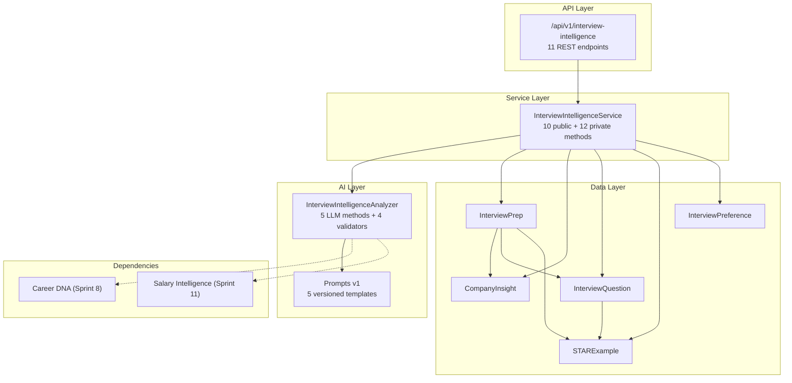
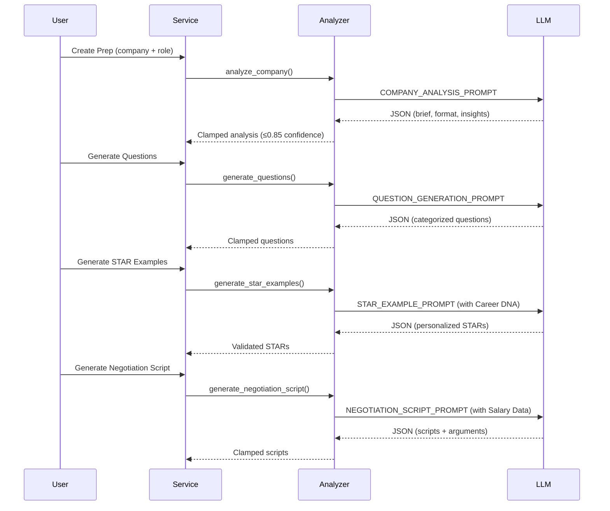

# Interview Intelligence™ — Architecture Reference

> **Sprint 14** · Phase C: Network Intelligence · Created 2026-02-21  
> **Status**: ✅ Tier-1 Audit Verified · 438/438 tests passing

---

## System Overview

---

## Domain Models

| Model                 | Table                   | Purpose                                        | Key Relationships                                                               |
| :-------------------- | :---------------------- | :--------------------------------------------- | :------------------------------------------------------------------------------ |
| `InterviewPrep`       | `interview_preps`       | Hub entity — one per company+role prep         | → CareerDNA, → User, ← CompanyInsight[], ← InterviewQuestion[], ← STARExample[] |
| `CompanyInsight`      | `company_insights`      | Company intelligence (format, culture, salary) | → InterviewPrep                                                                 |
| `InterviewQuestion`   | `interview_questions`   | Predicted questions + suggested answers        | → InterviewPrep, ← STARExample[]                                                |
| `STARExample`         | `star_examples`         | Career DNA–mapped STAR responses               | → InterviewPrep, → InterviewQuestion (nullable)                                 |
| `InterviewPreference` | `interview_preferences` | User prep preferences (depth, notifications)   | → CareerDNA (unique), → User                                                    |

**Enums:** `PrepStatus` (draft/analyzing/completed/failed), `InsightType` (format/culture/salary_band/process/values), `QuestionCategory` (behavioral/technical/situational/culture_fit/salary), `PrepDepth` (quick/standard/comprehensive)

**Constraints:** `confidence_score ≤ 0.85` (CheckConstraint on InterviewPrep)

---

## File Map

| Layer           | File                                                                                                                                                         | Lines | Key Exports                                            |
| :-------------- | :----------------------------------------------------------------------------------------------------------------------------------------------------------- | :---- | :----------------------------------------------------- |
| **Models**      | [interview_intelligence.py](file:///d:/ProfesionalDevelopment/AntigravityProjects/pathforge/apps/api/app/models/interview_intelligence.py)                   | 450   | 5 models, 4 enums                                      |
| **Schemas**     | [interview_intelligence.py](file:///d:/ProfesionalDevelopment/AntigravityProjects/pathforge/apps/api/app/schemas/interview_intelligence.py)                  | 262   | 8 response, 6 request schemas                          |
| **AI Prompts**  | [interview_intelligence_prompts.py](file:///d:/ProfesionalDevelopment/AntigravityProjects/pathforge/apps/api/app/ai/interview_intelligence_prompts.py)       | 238   | 5 versioned prompt templates                           |
| **AI Analyzer** | [interview_intelligence_analyzer.py](file:///d:/ProfesionalDevelopment/AntigravityProjects/pathforge/apps/api/app/ai/interview_intelligence_analyzer.py)     | 761   | 1 class, 5 LLM methods, 4 static helpers, 4 validators |
| **Service**     | [interview_intelligence_service.py](file:///d:/ProfesionalDevelopment/AntigravityProjects/pathforge/apps/api/app/services/interview_intelligence_service.py) | 659   | 10 public + 12 private methods                         |
| **Router**      | [interview_intelligence.py](file:///d:/ProfesionalDevelopment/AntigravityProjects/pathforge/apps/api/app/api/v1/interview_intelligence.py)                   | 357   | 11 REST endpoints                                      |
| **Migration**   | [3c4d5e6f7g8h](file:///d:/ProfesionalDevelopment/AntigravityProjects/pathforge/apps/api/alembic/versions/3c4d5e6f7g8h_add_interview_intelligence_tables.py)  | 273   | 5 tables (up/down)                                     |
| **Tests**       | [test_interview_intelligence.py](tests/test_interview_intelligence.py)                                                                                       | 920+  | 56 tests                                               |

---

## API Endpoints

| Method | Path                            | Rate Limit | Description                       |
| ------ | ------------------------------- | ---------- | --------------------------------- |
| GET    | `/dashboard`                    | —          | All saved preps + preferences     |
| POST   | `/prep`                         | 5/min      | Create interview prep session     |
| POST   | `/compare`                      | 3/min      | Compare 2-5 preps side-by-side    |
| GET    | `/preferences`                  | —          | Get interview preferences         |
| PUT    | `/preferences`                  | —          | Update interview preferences      |
| GET    | `/{prep_id}`                    | —          | Get specific prep with all data   |
| DELETE | `/{prep_id}`                    | —          | Delete prep + cascade children    |
| POST   | `/{prep_id}/questions`          | 5/min      | Generate additional questions     |
| POST   | `/{prep_id}/star-examples`      | 5/min      | Generate Career DNA STAR examples |
| POST   | `/{prep_id}/negotiation-script` | 3/min      | Generate negotiation scripts      |

---

## Proprietary Innovations

| Innovation                          | Implementation                                                            | Differentiator                                                   |
| :---------------------------------- | :------------------------------------------------------------------------ | :--------------------------------------------------------------- |
| 🔥 **Career DNA Interview Mapper™** | `generate_star_examples()` — maps Career DNA dimensions to STAR responses | Competitors use generic templates; we use YOUR career history    |
| 🔥 **Negotiation Script Engine™**   | `generate_negotiation_script()` — integrates Salary Intelligence data     | Competitors offer roleplay; we provide YOUR numbers with scripts |
| 🔥 **Company Culture Decoder™**     | `analyze_company()` + `calculate_culture_alignment()`                     | No competitor does culture-to-DNA matching                       |

---

## AI Pipeline

---

## Transparency & Safety

- **All responses** include `data_source` + `disclaimer` fields
- **Confidence hard cap**: 0.85 (enforced at DB level via CheckConstraint + analyzer clamping)
- **Input sanitization**: All user text passes through `sanitize_user_text()` before LLM calls
- **Rate limiting**: AI-heavy endpoints limited to 3-5 requests/minute
- **User isolation**: All queries filter by `user_id` — no cross-tenant data leakage
- **GDPR**: User-owned, deletable, no external sharing
- **Human-in-the-loop**: Negotiation scripts are suggestions, not automation
