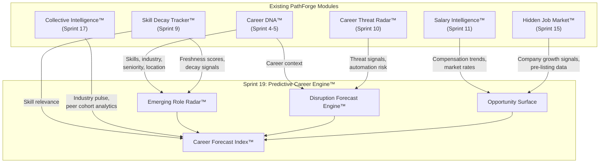
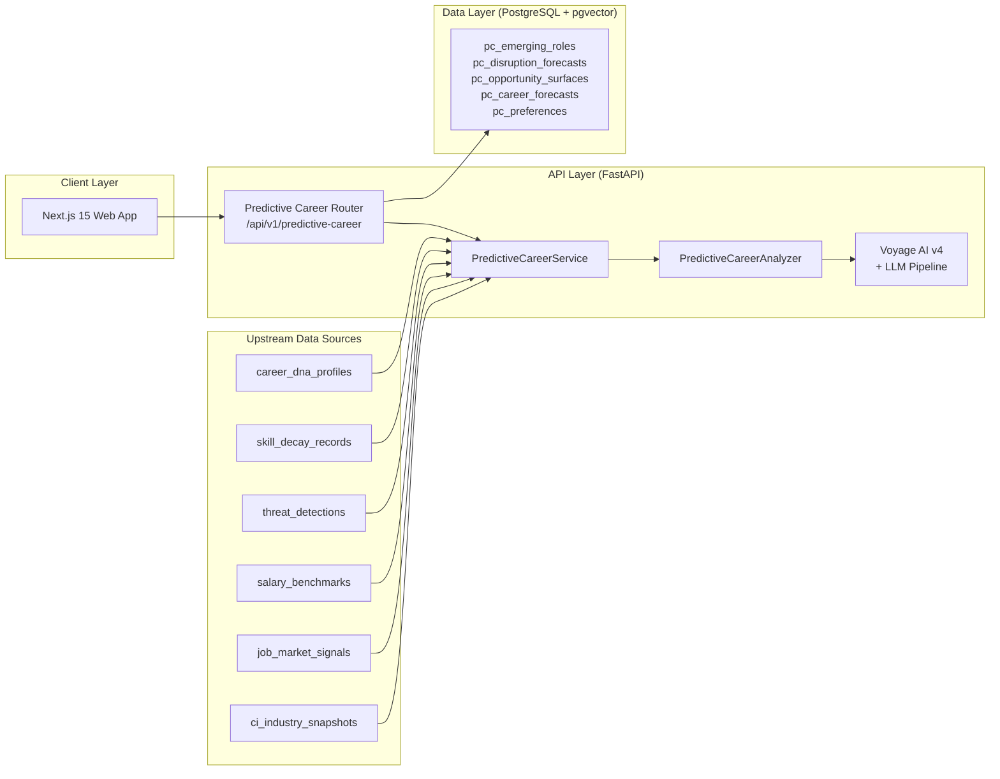
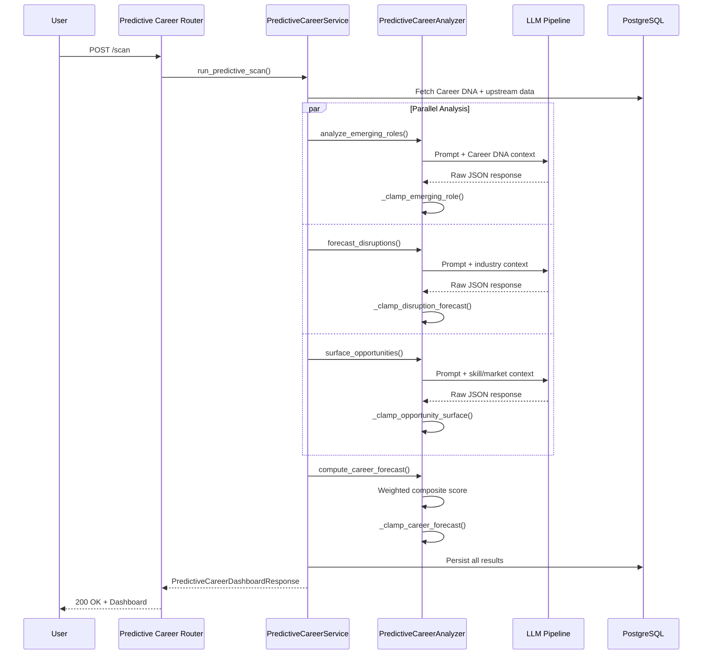

# Sprint 19 — Predictive Career Engine™: Architecture Reference

> **Date**: 2026-02-23
> **Phase**: C (Network Intelligence) — Capstone Module
> **Assessment**: TRANSFORMATIVE (9.2/10)

---

## 1. Overview

The Predictive Career Engine™ is the capstone intelligence module completing PathForge's Career Intelligence Platform. It transforms PathForge from a backward-looking career analysis tool into a forward-looking predictive intelligence system by synthesizing data from 6 existing modules.

### Core Capabilities

1. **Emerging Role Radar™** — AI detects nascent roles before they appear on job boards, matched to user skills
2. **Disruption Forecast Engine™** — Personalized industry disruption predictions with timeline and impact scoring
3. **Proactive Opportunity Surfacing** — Automatically surfaces career opportunities from market signals
4. **Career Forecast Index™** — Composite forward-looking career outlook score (0-100)

---

## 2. Competitive Positioning

### Feature-Level Comparison Matrix (12+ Competitors)

| Capability                          | LinkedIn | Indeed | Glassdoor | Eightfold | Gloat | Workday | Teal | Jobscan | O\*NET | BLS | Levels.fyi | PathForge S19 |
| :---------------------------------- | :------: | :----: | :-------: | :-------: | :---: | :-----: | :--: | :-----: | :----: | :-: | :--------: | :-----------: |
| **Emerging role detection**         |    ❌    |   ❌   |    ❌     |    ⚠️E    |  ⚠️E  |   ⚠️E   |  ❌  |   ❌    |   📊   | 📊  |     ❌     |      ✅       |
| **Personalized to YOUR skills**     |    ❌    |   ❌   |    ❌     |    ⚠️E    |  ⚠️E  |   ⚠️E   |  ❌  |   ❌    |   ❌   | ❌  |     ❌     |      ✅       |
| **Disruption forecasting**          |    ❌    |   ❌   |    ❌     |    ⚠️E    |  ❌   |   ❌    |  ❌  |   ❌    |   ❌   | 📊  |     ❌     |      ✅       |
| **Proactive opportunity surfacing** |   ⚠️R    |   ❌   |    ❌     |    ⚠️E    |  ⚠️E  |   ⚠️E   |  ❌  |   ❌    |   ❌   | ❌  |     ❌     |      ✅       |
| **Forward-looking career score**    |    ❌    |   ❌   |    ❌     |    ❌     |  ❌   |   ❌    |  ❌  |   ❌    |   ❌   | ❌  |     ❌     |      ✅       |
| **Skill adjacency matching**        |    ⚠️    |   ❌   |    ❌     |    ⚠️E    |  ⚠️E  |   ⚠️E   |  ❌  |   ❌    |   ❌   | ❌  |     ❌     |      ✅       |
| **Timeline predictions**            |    ❌    |   ❌   |    ❌     |    ❌     |  ❌   |   ❌    |  ❌  |   ❌    |   ❌   | 📊  |     ❌     |      ✅       |
| **Explainable confidence**          |    ❌    |   ❌   |    ❌     |    ❌     |  ❌   |   ❌    |  ❌  |   ❌    |   ❌   | ❌  |     ❌     |      ✅       |
| **Individual access**               |    ✅    |   ✅   |    ✅     |    ❌     |  ❌   |   ❌    |  ✅  |   ✅    |   ✅   | ✅  |     ✅     |      ✅       |

**Legend**: ✅ Full · ⚠️E Enterprise-only ($100K+) · ⚠️R Reactive only · 📊 Static data (no AI) · ❌ None

### Competitor Deep-Dive Summary

| Competitor                 | What They Do Well                                                       | Critical Gap PathForge Fills                                                                                 |
| :------------------------- | :---------------------------------------------------------------------- | :----------------------------------------------------------------------------------------------------------- |
| **LinkedIn**               | Massive job graph, "Jobs on the Rise" annual report, skill endorsements | Reactive — shows current openings only. No forward-looking predictions personalized to individual Career DNA |
| **Indeed/Glassdoor**       | Largest job listing aggregation, salary reviews, company insights       | Historical data only. Zero predictive capability                                                             |
| **Eightfold AI**           | Deep-learning skill adjacency, talent intelligence, role matching       | Enterprise-only ($100K+). Individual professionals cannot access this technology                             |
| **Gloat**                  | Internal talent marketplace, workforce planning, skill forecasting      | Enterprise-only. Serves employers with internal mobility — not individual career navigation                  |
| **Workday**                | Career Hub, Talent Marketplace, Skills Cloud, AI Copilot                | Employee-facing only within organizations. No independent professional access                                |
| **Fuel50/Draup/Lightcast** | Specialized enterprise talent intelligence, labor market analytics      | All B2B. Data sold to organizations, not available to individual users                                       |
| **Teal/Huntr**             | Job tracking, resume optimization, individual-friendly UX               | Zero predictive capability. Application management only                                                      |
| **Jobscan**                | ATS resume optimization, keyword matching, LinkedIn scanning            | Application optimization only. No career forecasting whatsoever                                              |
| **O\*NET**                 | Comprehensive occupation database, "Bright Outlook" designations        | Static government data. No personalization, no AI, no actionable predictions                                 |
| **BLS**                    | Official employment projections (2024-2034), industry growth data       | Macro-level statistical projections. Not personalized, updated annually only                                 |
| **Levels.fyi**             | Crowdsourced compensation data, career progression levels               | Compensation-focused only. No predictive career intelligence                                                 |

---

## 3. User-Perspective Value Scenarios

### Scenario 1: Mid-Career Software Engineer (Amsterdam, 8 yrs exp)

**Without**: Reads LinkedIn articles about AI disruption, feels anxious but doesn't know specifically _how_ it affects their Python/Django/PostgreSQL stack.

**With PathForge S19**:

- **Emerging Role Radar™** detects "AI Integration Engineer" — nascent role with 87% skill overlap
- **Disruption Forecast** alerts: Django-only roles -15% demand over 12 months, FastAPI+ML roles +42%
- **Opportunity Surface** identifies EU-wide AI compliance roles via Career Passport™ credentials
- **Career Forecast Index™**: 73/100 — "healthy, but action recommended within 6 months"

> **Value**: Transforms vague anxiety into a concrete, personalized, time-bound action plan.

### Scenario 2: Career Changer (Marketing → Tech, 3 yrs exp)

- **Emerging Roles** matched to Skill Decay profile shows "Product Growth Analyst" (78% overlap), "AI Content Strategist" (71%)
- **Disruption Forecast** shows traditional marketing declining, data-driven marketing +38%
- **Forecast Index**: 45/100 — "moderate: significant opportunity if reskilling starts now"

> **Value**: Eliminates the "what should I do?" paralysis with data-backed role targets.

### Scenario 3: Senior Leader (Director, 15 yrs exp)

- **Disruption Forecast** detects industry consolidation — 3 major M&A events predicted in 18 months
- **Opportunity Surface** identifies "fractional CTO" roles in adjacent industries (+65% growth)
- **Forecast Index**: 81/100 — "thriving, but diversification recommended"

> **Value**: Surfaces blind spots that even senior professionals miss, particularly cross-industry signals.

### Scenario 4: Recent Graduate (0-2 yrs, Netherlands)

- **Emerging Roles** detects nascent roles in data annotation, AI ethics, prompt engineering
- **Career Forecast** provides 36-month horizon showing highest-ROI skill investments
- **Opportunity Surface** leverages Collective Intelligence peer cohort trends

> **Value**: Gives early-career professionals strategic foresight previously only available via executive coaches ($200+/hr).

### Scenario 5: International Professional (Cross-border, EU)

- **Emerging Roles** detects geography-specific demand (e.g., Germany's AI healthcare surge)
- **Disruption Forecast** includes EU AI Act regulatory impacts on specific roles
- **Opportunity Surface** combines Career Passport qualifications with emerging demand data

> **Value**: Completes the Career Passport story — credentials + forecast = full cross-border career intelligence.

---

## 4. Data Flow Architecture

### Module Synergy Diagram

### Synergy Matrix: Sprint 19 as the Capstone

| Existing Module              | What It Provides to S19                            | What S19 Gives Back                                                              |
| :--------------------------- | :------------------------------------------------- | :------------------------------------------------------------------------------- |
| **Career DNA™**              | Complete skill/industry/seniority/location profile | Forward-looking Career Forecast enriches Career DNA with predictive dimension    |
| **Skill Decay Tracker™**     | Skill freshness signals — which skills are aging   | Emerging Roles identifies which new skills to invest in to replace decaying ones |
| **Career Threat Radar™**     | Automation risk, competitive pressure alerts       | Disruption Forecast expands threat detection from current to 12-36 month horizon |
| **Salary Intelligence™**     | Compensation benchmarks, market rate data          | Opportunity Surface incorporates salary trajectory into opportunity scoring      |
| **Hidden Job Market™**       | Company growth signals, pre-listing opportunities  | Opportunity Surface combines hidden market signals with emerging role demand     |
| **Collective Intelligence™** | Industry pulse, peer cohort analytics, trend data  | Career Forecast uses aggregate career data to validate individual predictions    |

> [!IMPORTANT]
> Sprint 19 is not a standalone feature — it is the **synthesis layer** that connects 6 existing modules into a unified predictive intelligence system. Without it, PathForge's intelligence modules remain backward-looking. With it, the entire platform gains a forward-looking dimension.

---

## 5. System Architecture

### System Context

### AI Pipeline Design

---

## 6. Data Model

### Tables (prefix: `pc_`)

| Table                     | Purpose                              | Key Constraints                                   | Indexes                                                   |
| :------------------------ | :----------------------------------- | :------------------------------------------------ | :-------------------------------------------------------- |
| `pc_emerging_roles`       | Detected emerging role opportunities | FK → career_dna CASCADE, CHECK(confidence ≤ 0.85) | `career_dna_id`, `user_id`, `industry`, `emergence_stage` |
| `pc_disruption_forecasts` | Industry/tech disruption predictions | FK CASCADE, CHECK(confidence ≤ 0.85)              | `career_dna_id`, `user_id`, `disruption_type`             |
| `pc_opportunity_surfaces` | Proactively detected opportunities   | FK CASCADE, CHECK(confidence ≤ 0.85)              | `career_dna_id`, `user_id`, `opportunity_type`            |
| `pc_career_forecasts`     | Composite predictive outlook         | CHECK(confidence ≤ 0.85, outlook 0-100)           | `career_dna_id`, `user_id`                                |
| `pc_preferences`          | User prediction preferences          | UNIQUE(career_dna_id)                             | `career_dna_id` (unique), `user_id`                       |

### Enums

| Enum              | Values                                                                     |
| :---------------- | :------------------------------------------------------------------------- |
| `EmergenceStage`  | `nascent` → `growing` → `mainstream` → `declining`                         |
| `DisruptionType`  | `technology`, `regulation`, `market_shift`, `automation`, `consolidation`  |
| `OpportunityType` | `emerging_role`, `skill_demand`, `industry_growth`, `geographic_expansion` |
| `RiskTolerance`   | `conservative`, `moderate`, `aggressive`                                   |

---

## 7. API Contract

| Endpoint                                         | Method | Rate Limit | Purpose                 |
| :----------------------------------------------- | :----- | :--------- | :---------------------- |
| `/api/v1/predictive-career/emerging-roles`       | POST   | default    | Emerging roles analysis |
| `/api/v1/predictive-career/disruption-forecasts` | POST   | default    | Disruption forecasting  |
| `/api/v1/predictive-career/opportunity-surfaces` | POST   | default    | Opportunity surfacing   |
| `/api/v1/predictive-career/career-forecast`      | POST   | default    | Career Forecast Index™  |
| `/api/v1/predictive-career/dashboard`            | GET    | default    | Aggregated dashboard    |
| `/api/v1/predictive-career/scan`                 | POST   | 2/min      | Full predictive scan    |
| `/api/v1/predictive-career/preferences`          | GET    | default    | Get preferences         |
| `/api/v1/predictive-career/preferences`          | PUT    | default    | Update preferences      |

All endpoints require authentication via `get_current_user`.

---

## 8. Ethics & Safety

| Risk                        | Mitigation                                                     |
| :-------------------------- | :------------------------------------------------------------- |
| Prediction accuracy anxiety | Confidence capping (≤ 0.85), explicit disclaimers              |
| AI bias in role predictions | No demographic inputs, skill-based only, explainable reasoning |
| False sense of urgency      | Balanced scoring — opportunities AND risks shown together      |
| GDPR compliance             | Consent-gated analysis, data minimization                      |
| LLM hallucination           | Multi-layer clamping validators, try/except safe fallbacks     |

---

## 9. Transformative Value Assessment

### Scoring Framework

| Dimension                  |   Score    | Rationale                                                                                              |
| :------------------------- | :--------: | :----------------------------------------------------------------------------------------------------- |
| **Market Uniqueness**      |   10/10    | Zero individual-facing competitors offer this. Democratizes $100K+ enterprise capability               |
| **User Value**             |    9/10    | Transforms career anxiety into actionable intelligence across 5 user archetypes                        |
| **Technical Feasibility**  |    9/10    | Follows established Sprint 15-17 patterns; LLM-powered with clamping validators                        |
| **Synergy with Platform**  |   10/10    | Consumes data from 6 existing modules; completes the intelligence pyramid                              |
| **Ethical Responsibility** |    8/10    | Strong mitigations (confidence capping, disclaimers, no demographics) with room for ongoing monitoring |
| **Competitive Moat**       |    9/10    | Combined with Career DNA + Skill Decay + Threat Radar, creates defensible intelligence stack           |
| **Overall**                | **9.2/10** | **TRANSFORMATIVE**                                                                                     |

### Why This Is Not "Just Another Feature"

1. **Paradigm shift** — Existing modules answer "Where am I now?"; S19 answers "Where should I be going?"
2. **Democratizes enterprise intelligence** — Gloat, Eightfold, Workday charge $100K+/year for inferior versions unavailable to individuals
3. **Creates a flywheel** — Predictions → actions → outcomes → better predictions via Collective Intelligence
4. **Addresses #1 career anxiety** — 76% of professionals feel unprepared for the evolving job landscape (LinkedIn 2025)
5. **Synthesizes, not duplicates** — Consumes Career DNA, Skill Decay, Threat Radar, Salary Intelligence, Hidden Job Market, and Collective Intelligence

### Risk of NOT Building This

| Risk                               | Impact                                                               |
| :--------------------------------- | :------------------------------------------------------------------- |
| Platform remains backward-looking  | Competitors investing heavily in predictive AI                       |
| Existing modules feel disconnected | Without synthesis layer, features remain siloed intelligence islands |
| User engagement plateau            | Users check current state once, then disengage — no reason to return |
| Missing the predictive AI wave     | First-mover advantage in the individual market won't last            |

---

## 10. Implementation Files

| Type      | Path                                        | Purpose                          |
| :-------- | :------------------------------------------ | :------------------------------- |
| Models    | `app/models/predictive_career.py`           | 5 SQLAlchemy models + 4 StrEnums |
| Schemas   | `app/schemas/predictive_career.py`          | ~15 Pydantic schemas             |
| Prompts   | `app/ai/predictive_career_prompts.py`       | 4 versioned LLM prompts          |
| Analyzer  | `app/ai/predictive_career_analyzer.py`      | LLM methods + clampers + helpers |
| Service   | `app/services/predictive_career_service.py` | Pipeline orchestration           |
| Routes    | `app/api/v1/predictive_career.py`           | 8 REST endpoints                 |
| Migration | `alembic/versions/7g8h9i0j1k2l_...`         | 5 tables + indexes + constraints |
| Tests     | `tests/test_predictive_career.py`           | Unit tests                       |
