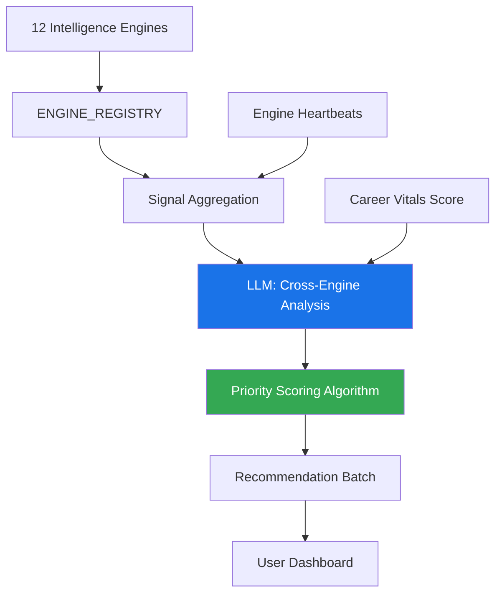
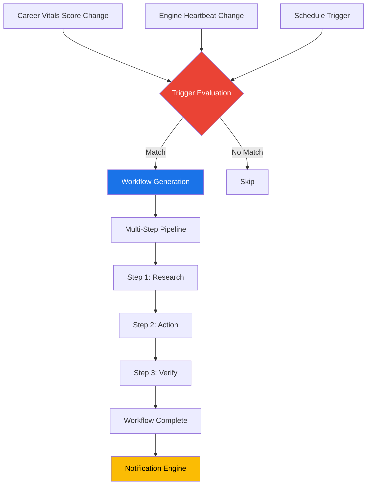
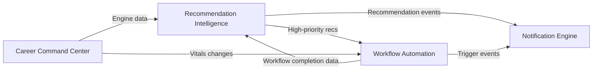

# Sprint 23 — Delivery Layer Architecture Reference

> **Phase:** D — Career Orchestration (Continuation)
> **Sprint:** 23 — Delivery Layer
> **Date:** 2026-02-24
> **Status:** Approved for Implementation
> **Author:** Antigravity AI (Trust-Grade Cognitive Excellence System)

---

## 1. Executive Summary

Sprint 23 introduces the **Delivery Layer** — PathForge's mechanism for converting passive intelligence dashboards into active, cross-engine recommendation pipelines and automated career workflows. This addresses the critical gap between _"here's your data"_ and _"here's what to do next."_

**Two features:** Cross-Engine Recommendation Intelligence™ and Career Workflow Automation Engine™.

---

## 2. Competitive Analysis

### 2.1 Competitor Matrix

| Competitor       | Type              | Cross-Engine Recommendations                  | Workflow Automation                     | Individual-Facing | Gap PathForge Fills                                         |
| :--------------- | :---------------- | :-------------------------------------------- | :-------------------------------------- | :---------------- | :---------------------------------------------------------- |
| **LinkedIn**     | Platform          | ❌ Single-module (jobs only, Two-Tower model) | ❌ None                                 | ✅ Yes            | No cross-module synthesis; no career workflow orchestration |
| **Eightfold AI** | Enterprise B2B    | ⚠️ Skills-based matching (enterprise)         | ✅ Workflow triggers (enterprise)       | ❌ No             | Enterprise-only; no individual-facing recommendation fusion |
| **Gloat**        | Enterprise B2B    | ⚠️ Skills Landscape (enterprise)              | ✅ Work Orchestration (enterprise)      | ❌ No             | Enterprise-only Signal/Mosaic/Ascend products               |
| **Workday**      | Enterprise B2B    | ⚠️ Skills Cloud (enterprise)                  | ⚠️ Illuminate agents (2026, enterprise) | ❌ No             | Career Hub isolated from cross-engine intelligence          |
| **Glassdoor**    | Market Data       | ❌ Company reviews only                       | ❌ None                                 | ✅ Yes            | No actionable recommendations; purely informational         |
| **Teal**         | Individual Tool   | ❌ ATS keyword matching only                  | ❌ Job tracker (manual)                 | ✅ Yes            | No intelligence synthesis; limited to resume optimization   |
| **Jobscan**      | Individual Tool   | ❌ Resume-to-JD matching only                 | ❌ None                                 | ✅ Yes            | Purely keyword-focused; no career intelligence              |
| **ONET/BLS**     | Data Source       | ❌ Occupational data only                     | ❌ None                                 | ⚠️ Reference      | Data sources, not intelligence platforms                    |
| **Levels.fyi**   | Compensation Data | ❌ Salary data only                           | ❌ None                                 | ✅ Yes            | Single-dimension (compensation); no career intelligence     |
| **Cruit**        | AI Career Planner | ⚠️ Career path AI (single-model)              | ❌ None                                 | ✅ Yes            | Single AI model, no multi-engine fusion                     |
| **CareersPro**   | AI Career Tool    | ⚠️ Transferable skills AI                     | ❌ None                                 | ✅ Yes            | No real-time engine integration; no workflow automation     |

### 2.2 Key Findings

> [!IMPORTANT]
> **No competitor — enterprise or individual — offers both cross-engine recommendation fusion AND automated career workflow generation in a single platform.** This is PathForge's Delivery Layer thesis.

**Enterprise platforms** (Eightfold, Gloat, Workday) have partial capabilities but are exclusively B2B:

- **Eightfold:** Workflow triggers for recruiters, not individuals. "Digital Twins" concept is close but focused on employer data, not individual career intelligence.
- **Gloat:** Work Orchestration breaks work into tasks, but orchestrates organizational talent, not individual career actions.
- **Workday:** Skills Cloud maps skills to opportunities within an organization, not across a personal intelligence ecosystem.

**Individual-facing tools** (Teal, Jobscan, Levels.fyi) are narrow single-purpose tools:

- **Teal:** Job tracker + ATS resume builder. No career intelligence fusion.
- **Jobscan:** Resume keyword optimizer. No career planning or workflow capabilities.
- **Levels.fyi:** Compensation benchmarking only. GPT-powered advisor, but no persistent intelligence.

**LinkedIn** is the closest individual-facing competitor with its Next Role Explorer and AI career path analysis, but:

- Recommendations come from a _single model_ (Two-Tower + LiRank), not 12 correlated engines.
- No automated career workflows or threshold-triggered actions.
- No transparency into how recommendations are generated.

---

## 3. User-Centered Value Assessment

### 3.1 User Persona: "The Strategic Career Navigator"

PathForge's target user is a knowledge worker who:

- Has completed Career DNA analysis and multiple intelligence engine scans
- Receives 12 separate intelligence dashboards but struggles to:
  - **Prioritize**: Which insight requires attention first?
  - **Correlate**: How does a Threat Radar alert relate to a Skill Decay warning?
  - **Act**: What concrete steps should they take, in what order?

### 3.2 User Pain Points Addressed

| Pain Point                | Current State (Sprint 22)                     | Sprint 23 Solution                                        |
| :------------------------ | :-------------------------------------------- | :-------------------------------------------------------- |
| **Information Overload**  | 12 separate engine dashboards                 | Unified recommendation stream with priority ranking       |
| **Correlation Blindness** | No visibility into cross-engine relationships | Cross-Engine Correlation Map showing causal links         |
| **Action Paralysis**      | User must manually create action plans        | Automated workflow generation with step-by-step guidance  |
| **Stale Intelligence**    | User must manually check each engine          | Threshold-triggered workflows fire when conditions change |
| **Progress Tracking**     | No multi-step career action tracking          | Complete workflow lifecycle (create → track → complete)   |

### 3.3 Value Proposition Score

| Dimension                  | Score      | Rationale                                                                 |
| :------------------------- | :--------- | :------------------------------------------------------------------------ |
| **Novelty**                | 9/10       | No individual-facing competitor offers cross-engine recommendation fusion |
| **User Impact**            | 9/10       | Converts 12 passive dashboards into actionable career acceleration        |
| **Technical Feasibility**  | 8/10       | Builds on existing ENGINE_REGISTRY and Career Vitals™ infrastructure      |
| **Market Differentiation** | 10/10      | Zero competitors in this space for individual users                       |
| **Revenue Potential**      | 8/10       | Premium tier feature — recommendation quality drives retention            |
| **Overall**                | **8.8/10** | **Transformative capability with clear market gap**                       |

---

## 4. Feature Specifications

### 4.1 Cross-Engine Recommendation Intelligence™

**Purpose:** Synthesize insights from all 12 intelligence engines into a prioritized, actionable recommendation stream.

**Proprietary Innovations:**

| Innovation                                  | Description                                                                                             | Competitive Status                                     |
| :------------------------------------------ | :------------------------------------------------------------------------------------------------------ | :----------------------------------------------------- |
| **Intelligence Fusion Engine™**             | Multi-engine signal correlation using weighted engine data from Career Command Center's ENGINE_REGISTRY | No competitor equivalent for individual careers        |
| **Priority-Weighted Recommendation Score™** | `urgency (0.40) × impact (0.35) × inverse_effort (0.25)` scoring formula                                | Goes beyond LinkedIn's pCTR; factors effort estimation |
| **Cross-Engine Correlation Map™**           | Per-recommendation visualization of which engines contributed and with what strength                    | No competitor offers per-recommendation transparency   |

**Architecture:**

**Data Model:**

| Model                       | Table                | Key Fields                                                                                                                                 |
| :-------------------------- | :------------------- | :----------------------------------------------------------------------------------------------------------------------------------------- |
| `CrossEngineRecommendation` | `ri_recommendations` | `user_id`, `recommendation_type`, `priority_score`, `urgency`, `impact_score`, `effort_level`, `source_engines` (JSON), `confidence_score` |
| `RecommendationCorrelation` | `ri_correlations`    | `recommendation_id` (FK), `engine_name`, `correlation_strength`, `insight_summary`                                                         |
| `RecommendationBatch`       | `ri_batches`         | `user_id`, `batch_type`, `engine_snapshot` (JSON), `career_vitals_at_generation`                                                           |
| `RecommendationPreference`  | `ri_preferences`     | `user_id`, `enabled_categories`, `min_priority_threshold`, `max_recommendations_per_batch`                                                 |

**Enums:**

- `RecommendationType`: skill_gap, threat_mitigation, opportunity, salary_optimization, career_acceleration, network_building
- `RecommendationStatus`: pending, in_progress, completed, dismissed, expired
- `EffortLevel`: quick_win, moderate, significant, major_initiative

**AI Pipeline:**

- 3 LLM methods using `complete_json_with_transparency()` with OWASP LLM01-hardened prompts
- `MAX_RECOMMENDATION_CONFIDENCE = 0.85` cap (consistent with all PathForge engines)
- Transparency fields: `data_source`, `disclaimer` on all responses

**API Surface:** 9 REST endpoints at `/api/v1/recommendation-intelligence`

### 4.2 Career Workflow Automation Engine™

**Purpose:** Convert Career Vitals™ thresholds and engine state changes into automated multi-step career workflows.

**Proprietary Innovations:**

| Innovation                         | Description                                                                                                          | Competitive Status                                                 |
| :--------------------------------- | :------------------------------------------------------------------------------------------------------------------- | :----------------------------------------------------------------- |
| **Threshold-Triggered Workflows™** | Automated workflow generation when Career Vitals™ score or engine heartbeat crosses user-defined thresholds          | Eightfold has enterprise triggers; no individual-facing equivalent |
| **Multi-Step Career Pipeline™**    | Sequential action orchestration with step-by-step progress tracking, duration estimates, and completion verification | Gloat's Work Orchestration is enterprise-only                      |
| **Smart Workflow Templates™**      | Context-aware workflow templates based on trigger type, career context, and engine data                              | No competitor offers AI-generated career workflow templates        |

**Architecture:**

**Data Model:**

| Model                | Table            | Key Fields                                                                                                                       |
| :------------------- | :--------------- | :------------------------------------------------------------------------------------------------------------------------------- |
| `CareerWorkflow`     | `wf_workflows`   | `user_id`, `workflow_type`, `trigger_source`, `trigger_condition` (JSON), `status`, `total_steps`, `completed_steps`, `due_date` |
| `WorkflowStep`       | `wf_steps`       | `workflow_id` (FK), `step_number`, `action_type`, `status`, `estimated_duration_minutes`, `completed_at`                         |
| `WorkflowTrigger`    | `wf_triggers`    | `user_id`, `trigger_type`, `source_engine`, `condition` (JSON), `is_active`, `fire_count`                                        |
| `WorkflowPreference` | `wf_preferences` | `user_id`, `auto_generate_workflows`, `max_active_workflows`, `notification_on_trigger`                                          |

**Enums:**

- `WorkflowType`: skill_development, threat_response, opportunity_pursuit, career_transition, salary_optimization, network_expansion
- `WorkflowStatus`: draft, active, paused, completed, cancelled, expired
- `StepStatus`: pending, in_progress, completed, skipped, blocked
- `TriggerType`: vitals_threshold, engine_heartbeat_change, score_drop, new_opportunity, schedule

**API Surface:** 11 REST endpoints at `/api/v1/career-workflow`

---

## 5. Integration Architecture

### 5.1 Sprint 22 Dependencies

Both features build directly on Sprint 22 infrastructure:

| Sprint 22 Component                        | Used By                     | Integration Point                              |
| :----------------------------------------- | :-------------------------- | :--------------------------------------------- |
| Career Command Center™ (`ENGINE_REGISTRY`) | Recommendation Intelligence | Signal aggregation from all 12 engines         |
| Career Vitals™ Score                       | Both features               | Threshold triggers + recommendation context    |
| Engine Heartbeat™                          | Both features               | Freshness detection + state change triggers    |
| Notification Engine™                       | Workflow Automation         | Trigger-fired notifications on workflow events |

### 5.2 Cross-Feature Integration

---

## 6. Ethics & Safety

Consistent with PathForge principles (ADR-004: Human-in-the-Loop):

| Safeguard               | Implementation                                                    |
| :---------------------- | :---------------------------------------------------------------- |
| **Confidence Cap**      | `MAX_RECOMMENDATION_CONFIDENCE = 0.85` on all AI outputs          |
| **Human-in-the-Loop**   | Workflows suggest, never auto-execute career actions              |
| **Transparency**        | `data_source` + `disclaimer` on every response                    |
| **Anti-Overconfidence** | Prompts include "estimates not guarantees" framing                |
| **User Control**        | Triggers are user-configurable with enable/disable toggle         |
| **Privacy**             | All data scoped to authenticated user; no cross-user intelligence |

---

## 7. Delivery Plan

| Component                                  | Files                   | Tests    | Estimate                |
| :----------------------------------------- | :---------------------- | :------- | :---------------------- |
| Recommendation Intelligence Models + Enums | 1                       | ~6       | Low complexity          |
| Recommendation Intelligence Schemas        | 1                       | ~10      | Low complexity          |
| Recommendation Intelligence Analyzer       | 1                       | ~8       | Medium complexity (LLM) |
| Recommendation Intelligence Service        | 1                       | ~14      | Medium complexity       |
| Recommendation Intelligence API Routes     | 1                       | ~17      | Low complexity          |
| Workflow Automation Models + Enums         | 1                       | ~8       | Low complexity          |
| Workflow Automation Schemas                | 1                       | ~8       | Low complexity          |
| Workflow Automation Service                | 1                       | ~20      | Medium complexity       |
| Workflow Automation API Routes             | 1                       | ~19      | Low complexity          |
| Alembic Migration                          | 1                       | —        | Low complexity          |
| Infrastructure (main.py, **init**.py)      | 2                       | —        | Trivial                 |
| **Totals**                                 | **12 new + 2 modified** | **~110** | —                       |

**Expected metrics after Sprint 23:**

- Endpoints: 137 → ~157
- Models: 58 → ~66
- Tests: 901 → ~1,010
- Migrations: 21 → 22

---

## 8. Decision Log

| Decision                                          | Rationale                                                                                | Alternatives Considered                                 |
| :------------------------------------------------ | :--------------------------------------------------------------------------------------- | :------------------------------------------------------ |
| Two features over one deep feature                | Establishes complete Delivery Layer pipeline (intelligence → action)                     | Single deep feature would leave action gap              |
| Static priority formula over LLM-only scoring     | Reproducible, testable, explainable scores; LLM provides context, not final score        | Pure LLM scoring (non-deterministic, untestable)        |
| Trigger-based workflows over scheduled-only       | Responsive to real career events; scheduled as fallback option                           | Scheduled-only (misses time-sensitive signals)          |
| JSON columns for flexible data over rigid schemas | Engine snapshots and trigger conditions evolve; JSON provides forward-compatible storage | Rigid columns (migration-heavy for every schema change) |
| Table prefix `ri_` / `wf_`                        | Namespace isolation consistent with `cc_` (Career Command Center) pattern                | No prefix (collision risk in 60+ table space)           |
